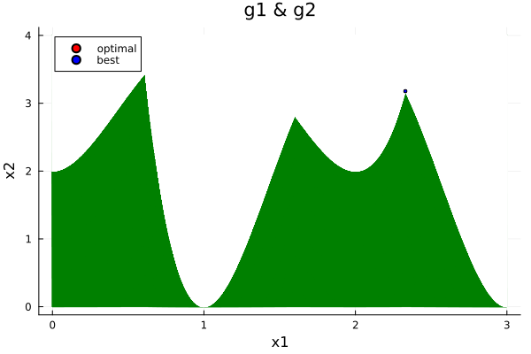
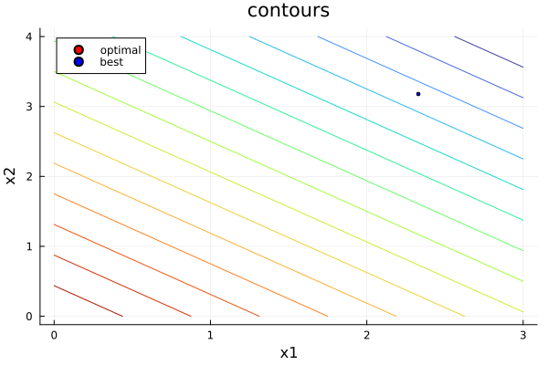
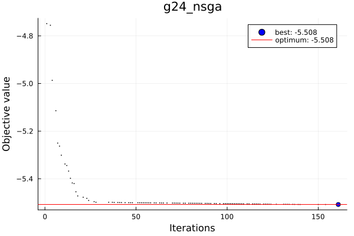
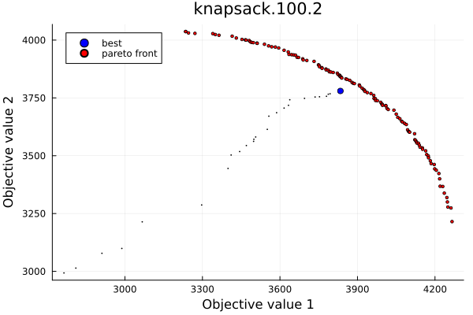

<div id="top"></div>

<!-- PROJECT LOGO -->
<br />
<div align="center">
  <h3 align="center">Multi Objective Evolutionary Optimization</h3>

  <p align="center">
    HW 2 of Evolutionary Optimization Algorithms (EOA).
  </p>
</div>

<!-- TABLE OF CONTENTS -->
<details>
  <summary>Table of Contents</summary>
  <ol>
    <li>
      <a href="#about-the-project">About The Project</a>
    </li>
    <li>
      <a href="#getting-started">Getting Started</a>
      <ul>
        <li><a href="#packages">Packages</a></li>
        <li><a href="#installation">Installation</a></li>
      </ul>
    </li>
   <li>
      <a href="#algorithms">Algorithms</a>
    </li>
    <li>
      <a href="#usage">Usage</a>
      <ul>
        <li><a href="#description">Description</a></li>
        <li><a href="#example">Examples</a></li>
        <li><a href="#visualization">Visualization</a></li>
      </ul>
    </li>
  </ol>
</details>


<!-- ABOUT THE PROJECT -->
## About The Project

This project is the implementation of second homework: https://cw.fel.cvut.cz/wiki/courses/a0m33eoa/hw/hw2 and <a href="#usage">example</a> of how to use the project
is provided.

<p align="right">(<a href="#top">back to top</a>)</p>

<!-- GETTING STARTED -->
## Getting Started

To get a local copy up and running follow these example steps,
program was made for [Julia 1.9](https://julialang.org/).

### Packages

1) [Distributions](https://github.com/JuliaStats/Distributions.jl)
2) [JSON](https://github.com/JuliaIO/JSON.jl)
3) [Plots](https://docs.juliaplots.org/latest/) 
4) [Random](https://docs.julialang.org/en/v1/stdlib/Random/) 
5) [LinearAlgebra](https://github.com/JuliaLang/LinearAlgebra.jl) 

### Installation

Use [Pkg](https://docs.julialang.org/en/v1/stdlib/Pkg/) to install project from GitHub, or download the project and activate the enviroment inside root, then it can be used similary (Do not forget to install the required libraries or use "Pkg.initiaite()").
```julia
(env) pkg> add https://github.com/Matyxus/Moea
```
<p align="right">(<a href="#top">back to top</a>)</p>

<!-- Scenario -->
## Algorithms
Short description of algorithms implemented for solving TSP, details can be found
in their individual julia files:

<details>
  <summary>Stochastic Ranking</summary>
  Standard implementation of Stochastic Ranking for single objective optimization,
  used rank based tournament selection (which after sorting the population defaults to choosing the invidivual with lower index).
</details>

<details>
  <summary>NSGA-II</summary>
  Classical implementation of algorithm is provided. It is defind for both single and multi objective optimization, modified binary tournament operator is also provided to choose better solutions.
</details>

<p align="right">(<a href="#top">back to top</a>)</p>

<!-- USAGE EXAMPLES -->
## Usage
To use the project, run the following command:
```julia
using Moea
# Probblem definition
def::Definition = Definition("g08", Minimization, Numbers, 2)
# Objective function
function f(x)::Float64
    # Handle 0/0 -> NaN case
    value::Float64 = - ((sin(2*π*x[1])^3) * (sin(2*pi*x[2]))) / ((x[1]^3) * (x[1] + x[2]))
    return isnan(value) ? opposite_extrema(def.problem_type) : value
end
# Constrains
g1(x)::Float64 = x[1]^2 - x[2] + 1
g2(x)::Float64 = 1 - x[1] + (x[2] - 4)^2
# Structures
opt::Optimization = Optimization(f, 1, [g1, g2], ((0, 0), (10, 10)))
prob::Problem = Problem(def, opt)
# Algorithms
nsga::NsgaII = NsgaII(prob, uniform_init, binary_tournament_selection, blend_crossover, normal_mutation!, crossover_chance=0.8, mutation_chance=0.05)
sr::StochasticRanking = StochasticRanking(prob, uniform_init, tournament_selection, blend_crossover, normal_mutation!, crossover_chance=0.3, mutation_chance=0.2)
# Run
run_algorithm(5000, nsga, "g08_nsga")
run_algorithm(5000, sr, "g08_sr")
```

### Description
First user must define the optimization function(s) and its constraint(s),
afterwards structures:
1) "Definition": defines basic attributes of problem: (name, optimization type -> Minimization or Maximization, Representation type: Binary, Numbers or Perumutation, number of parameters).
2) "Optimization": structure is defined by optimization funcion (or vector of function), their count, constrain function (or vector), their count, finnally lower and upper bounds (optional) are defined as 2 Tuples (first all lower bounds of parameters, then upper).
3) "Problem": holds both previous structures and formulates the whole problem.
4) Algorithm structure is then given the "Problem" and function we want to use.
5) Finally 'run_algorithm' function is used, which takes the total number of iterations, algorithm and name of file recording results, saved in [data/logs](https://github.com/Matyxus/Moea/tree/main/data/logs) directory

### Example
Example files of how to use program and define strucures is shown in: <a href="#usage">example</a> and more examples are provided in directory: [examples](https://github.com/Matyxus/Moea/tree/main/examples).


### Visualization
There are two types of visualization provided for this work,
first one being for visualization of contours of defined functions (__only for 2D problems__) defined in example of [plots](https://github.com/Matyxus/Moea/blob/main/examples/plots/contours_example.jl):
```julia
using Moea
# Objective function
f(x)::Float64 = -x[1] - x[2]
# Constrains
g1(x)::Float64 = -2*(x[1]^4) + 8*(x[1]^3) - 8*(x[1]^2) + x[2] - 2
g2(x)::Float64 = -4*(x[1]^4) + 32*(x[1]^3) - 88*(x[1]^2) + 96*x[1] + x[2] - 36
# Probblem definition
def::Definition = Definition("g24", Minimization, Numbers, 2)
opt::Optimization = Optimization(f, 1, [g1, g2], ((0, 0), (3, 4)))
prob::Problem = Problem(def, opt)

optimal::Tuple = (2.32952019747762, 3.17849307411774)
best::Tuple =  (2.329520164828056, 3.178492575044285)
plot = plot_constrain(x -> max(g1(x), g2(x)), opt.bounds[1], opt.bounds[2], "g1 & g2", optimal, best)
```
This image shows feasible space of both constrains (optimal and best points overlap):\
\
Objective function can also be visualized (optimal and best points overlap):
```julia
using Moea
# Objective function
f(x)::Float64 = -x[1] - x[2]
# Constrains
g1(x)::Float64 = -2*(x[1]^4) + 8*(x[1]^3) - 8*(x[1]^2) + x[2] - 2
g2(x)::Float64 = -4*(x[1]^4) + 32*(x[1]^3) - 88*(x[1]^2) + 96*x[1] + x[2] - 36
# Probblem definition
def::Definition = Definition("g24", Minimization, Numbers, 2)
opt::Optimization = Optimization(f, 1, [g1, g2], ((0, 0), (3, 4)))
prob::Problem = Problem(def, opt)

optimal::Tuple = (2.32952019747762, 3.17849307411774)
best::Tuple =  (2.329520164828056, 3.178492575044285)
plot = plot_objective(f, opt.bounds[1], opt.bounds[2], optimal, best)
```


Second one being for visualizing algorithm's entire run:
```julia
using Moea
optimum::Real = -5.50801327159536
# Name of log file in data/logs directory
plot = plot_result("g24_nsga", "g24_nsga", optimum)
```



Similary for visualizing knapsack results:
```julia
using Moea
# Name of log file in data/logs directory + name of pareto front (optional)
plot_knapsack_result("knapsack_100_2", "knapsack.100.2", "knapsack.100.2.pareto")
```


<p align="right">(<a href="#top">back to top</a>)</p>